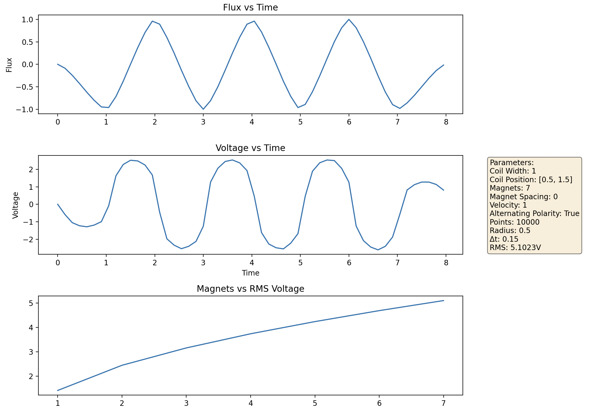
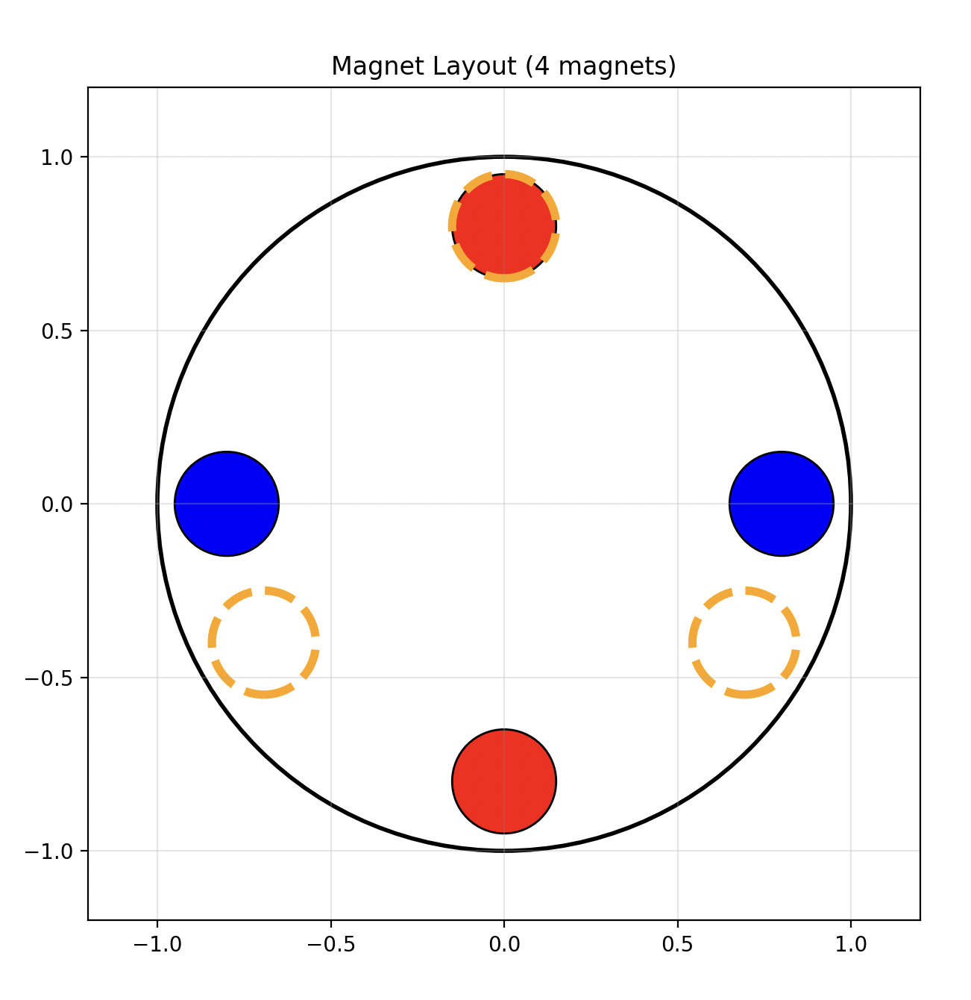
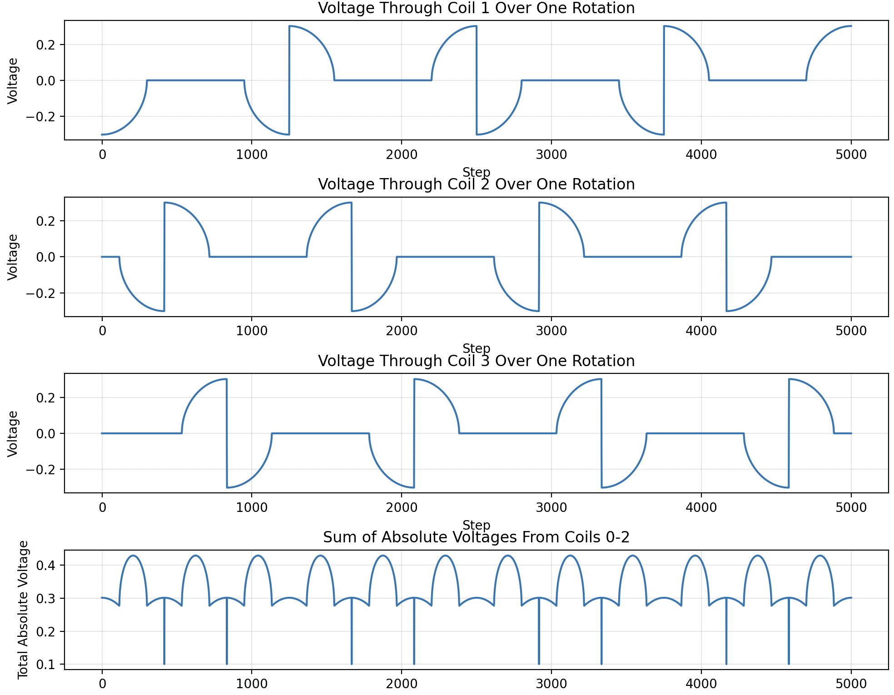

For linear model:

This is for my own purpose of coding again without any AI assistance trying to model generators and seeing how efficiency can be altered based on magnet polarity, spacing, and coil spacing. This is intentionally written as a dirty script and not meant to be close to production readiness ( Subject to change)

See  for the output. 

------
------
Three phase model still was mainly handcrafted still but asked LLMs for some long forgotten geometric formulas. You can model multiple magnets and coils to simulate a rotor and stator now. Gives the ability to visualize things like 3-phase AC power with diff magnet sizes, polarity, spacing again, etc

 Magnets are the red and blue ( representing polarity) and the golden broken circles represent coils and the resulting graph of the generated voltage:

